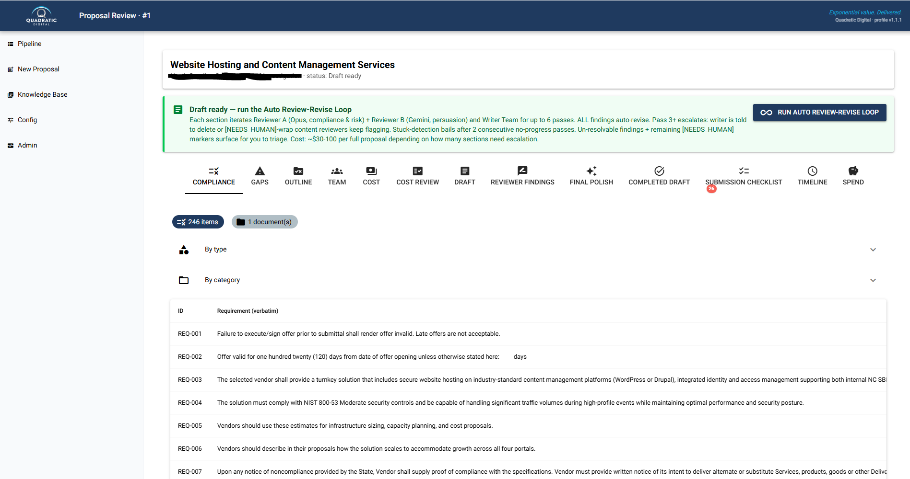
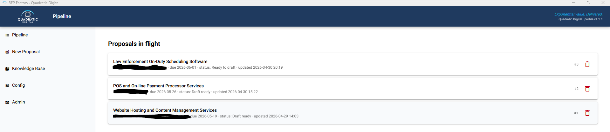
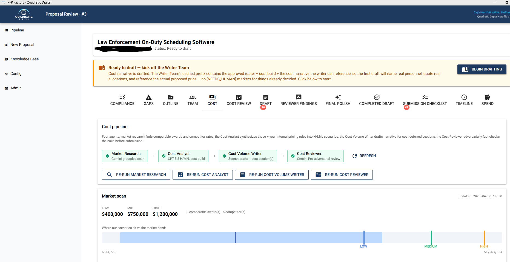
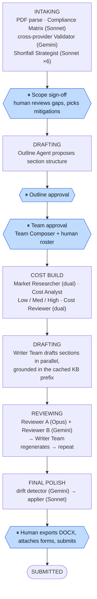

# RFP Factory

**A multi-agent system that turns a federal RFP package into a submission-ready proposal — compliance matrix, gap analysis, priced cost volume, drafted narrative, adversarial review, and a polished DOCX — in under two hours instead of forty.**

RFP Factory ingests an RFP package (PDFs/DOCX) and drives it through a fixed,
human-checkpointed pipeline staffed by **34 specialized LLM agents**. It extracts
every requirement verbatim, analyzes capability gaps and recommends mitigations,
builds a defensible cost/P&L across three pricing scenarios, drafts every section
grounded in a company knowledge base, runs a dual-model adversarial review loop,
and compiles a formatted proposal with a submission checklist.

It is **local-first and human-in-the-loop by design**: agents draft and review,
but a person signs off at every gate that requires judgment, and nothing is ever
auto-submitted (a hard FAR/compliance constraint).

> **Note on data:** the `data/*.json` files in this repository are *illustrative
> samples* for a fictional company ("Acme Federal Solutions"). Real company
> profiles, pricing models, and partner data are private and never committed —
> copy the `.example.json` templates to their un-suffixed names to run the system.

---

## Screenshots



*The proposal working page — **246 compliance requirements auto-extracted verbatim** from the RFP packet, across a 13-stage tabbed workflow (compliance → gaps → cost → draft → review → polish → export). Client name redacted.*

<table>
<tr>
<td width="50%"></td>
<td width="50%"></td>
</tr>
<tr>
<td align="center"><em>Multiple proposals in flight</em></td>
<td align="center"><em>Adversarial cost review — Gemini Pro + GPT-5.5 in parallel</em></td>
</tr>
</table>

---

## Why it's built this way

Federal proposals are high-stakes, compliance-bound, and enormously time-consuming.
A single LLM "write me a proposal" prompt fails on all three counts — it
hallucinates past performance, ignores FAR rules, and can't be trusted with pricing.
RFP Factory is engineered around those failure modes:

| Design decision | Why |
|---|---|
| **Fixed pipeline with human gates** (not a one-click macro) | Every consequential decision — scope sign-off, outline approval, team roster, accept/dismiss findings — stays with a person. Auto-apply behaviors exist but are bounded, reversible, and audit-logged. |
| **Multi-provider routing, per role** | Gemini 2.5 Pro's huge context window is best for whole-corpus synthesis and validation; Claude Opus/Sonnet is best for drafting and reasoning; Haiku handles cheap extraction. Each of the 34 agents runs on the model that's strongest for its job. |
| **Cross-provider validation** | The Compliance Matrix (Sonnet) is validated by a *different provider* (Gemini) — a same-family validator shares blind spots with the drafter and is near-useless. Different provider = genuinely independent second opinion. |
| **Dual-pipeline adversarial research** | Teaming and market research each run two providers in parallel (Gemini grounded + Claude web-search) and reconcile via a pure-Python consolidator. Cross-provider *agreement* is itself evidence; single-provider hits are flagged `needs_review`. |
| **Grounded generation (RAG), not free recall** | A cached ~58K-token prefix — company profile + knowledge base + teaming library + institutional decisions — is injected into every writer call. Citations trace only to won/subbed past performance; Reviewer A enforces it. |
| **Cost governance** | Every LLM call is written to an `agent_runs` ledger with token counts and USD cost; per-run and monthly spend caps are enforced. A typical proposal runs ~$45–130 end to end, itemized by stage. |
| **Compliance as a hard constraint** | No automated submission (FAR debarment risk), no competitor/copyrighted material in the KB, and no profile change without explicit human approval — enforced in every agent prompt and checked by reviewers. |

---

## Pipeline

The proposal advances through a strict, forward-only status machine (with crash
recovery that reverts stuck in-flight statuses on restart). Human checkpoints are
marked ⏸.



---

## The agent roster (34 modules)

A representative slice — every agent has a tool schema, a system prompt, and a thin
wrapper that records cost and handles streaming + retries. Full detail in
[`docs/RFP_System_Architecture.md`](docs/RFP_System_Architecture.md).

| Agent | Model | Job |
|---|---|---|
| Compliance Matrix | Sonnet | Verbatim-extract every shall/must/should/submission requirement |
| Compliance Validator | Gemini | Independent cross-provider validation of the matrix |
| Shortfall Strategist | Sonnet ×6 | Per-gap mitigation (teaming / self-perform / build / equivalent-experience / no-bid) |
| Teaming Researcher A / B / Consolidator | Gemini grounded · Claude web-search · Python | Dual-pipeline partner discovery with consensus scoring |
| Market Researcher A / B / Consolidator | Gemini grounded · Claude web-search · Python | Comparable awards + competitor rate research |
| Outline Agent · Team Composer | Sonnet | Section structure + proposed roster |
| Cost Analyst · Cost Reviewer ×2 · Strategy | Sonnet | H/M/L pricing build + dual adversarial cost review + value strategy |
| Cost / Section Writers · Writer Team | Sonnet → Opus | Grounded sectional drafting (parallel), Opus on revision passes |
| Reviewer A · Reviewer B | Opus · Gemini | Compliance/risk review + persuasion review |
| Final Polish Detector · Applier | Gemini · Sonnet | Cross-section consistency drift → surgical edits |
| Intake / KB / Consistency / Needs-Human agents | Haiku | Cheap high-volume extraction + placeholder resolution |

---

## Tech stack

- **App:** FastAPI + NiceGUI (single-page, tabbed working UI), Python 3.12+
- **Data:** SQLite + SQLAlchemy 2.0 + Alembic (24 migrations), foreign-key-enforced
- **LLM providers:** Anthropic (Opus/Sonnet/Haiku), Google Gemini 2.5 Pro, OpenAI,
  Voyage embeddings — all routed through a single `services/llm.py` that records
  cost, streams tool calls, and retries transient errors
- **Infra:** Docker + docker-compose, background daemon-thread orchestrators
- **Testing:** deterministic no-cost E2E suite (`scripts/_e2e_*.py`) exercising real
  wiring + opt-in live smoke tests

## Architecture at a glance

```
app/
├── agents/     # 34 LLM agent modules — one file per role, tool schema + prompt + wrapper
├── jobs/       # background orchestrators (intake, writer, cost, reviewer, final_polish)
├── services/   # 33 shared modules — llm.py (all calls), pricing, team, sections, export…
├── models/     # SQLAlchemy ORM (proposals, sections, findings, pricing, cost ledger)
├── core/       # company-profile / pricing / decisions loaders + enums
└── ui/pages.py # every NiceGUI page and tab
alembic/        # 24 DB migrations
data/           # *.example.json templates (real data stays local)
docs/           # RFP_System_Architecture.md — the full design
```

## Run it

```bash
cp .env.example .env          # set APP_STORAGE_SECRET + provider API keys
# Provide your own data (or start from the samples):
cp data/company_profile.example.json      data/company_profile.json
cp data/internal_pricing_rules.example.json data/internal_pricing_rules.json
cp data/teaming_partners.example.json     data/teaming_partners.json
cp data/decisions.example.json            data/decisions.json

docker compose up --build     # → http://localhost:8000
# or, without Docker:
python -m venv .venv && . .venv/Scripts/activate
pip install -e ".[dev]"
alembic upgrade head
python -m app.main
```

Run the deterministic (no-cost, no-API) test suite:

```powershell
.\.venv\Scripts\python.exe scripts\_e2e_deterministic_suite.py
```
