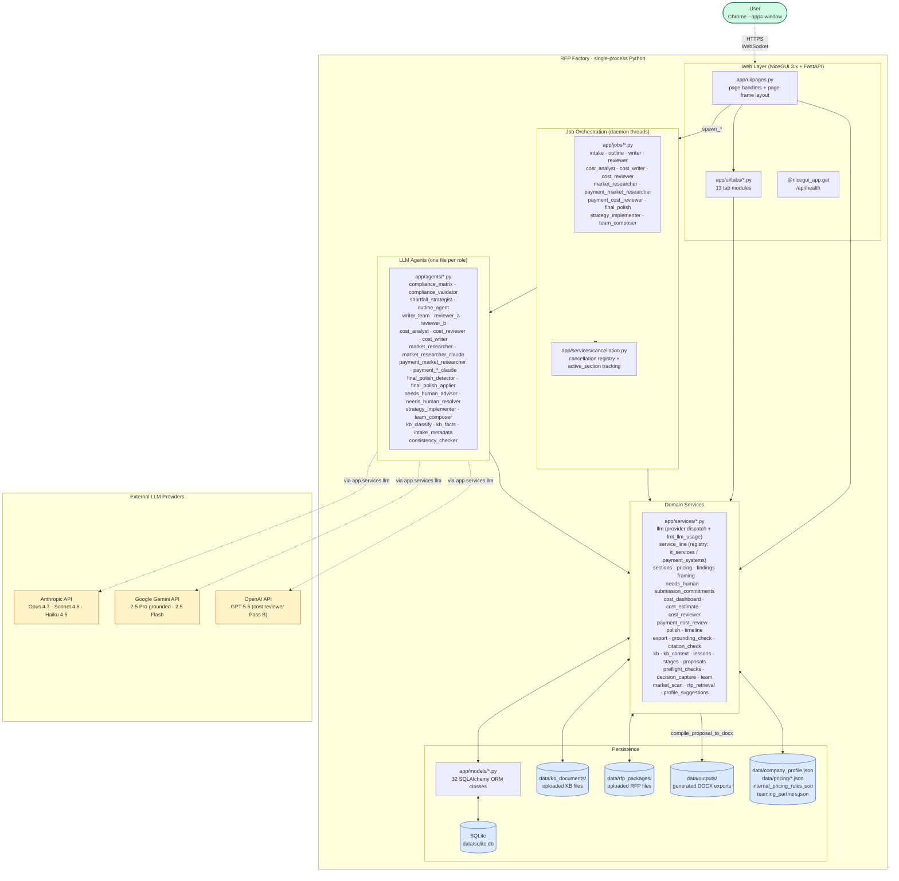
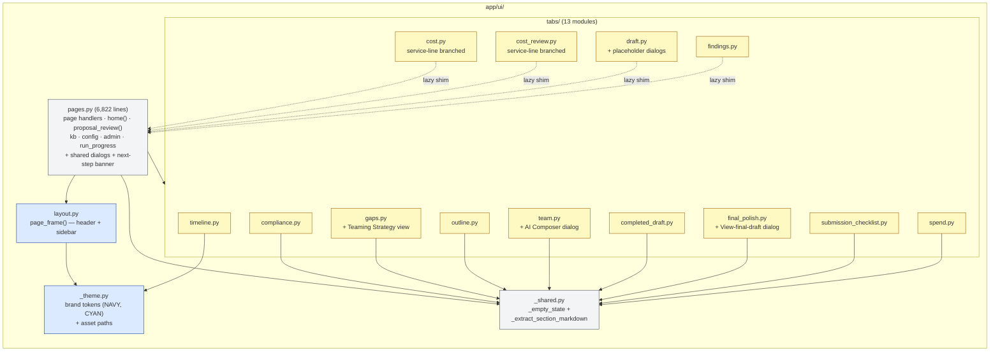
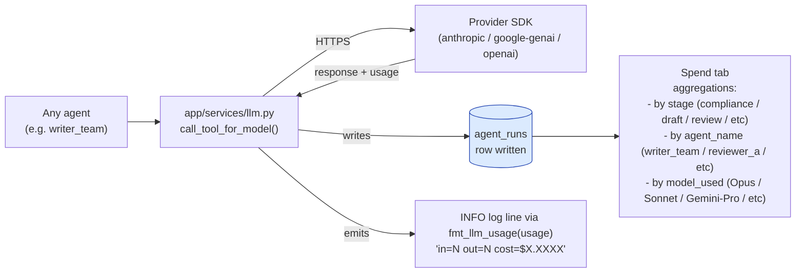

# RFP Factory — System Architecture

Single-source architecture reference for the Quadratic Digital RFP Factory. Three diagrams cover the system at three resolutions: **system-overview** (layers + externals), **pipeline-flow** (agents + state transitions), and **schema** (DB relationships). Plus a UI module map.

State of this document: 2026-04-30, post-modularization, post-Phase 2B (payment_systems pipeline live).

---

## 1. System Overview

Top-down view of the runtime: browser → app layers → external LLM APIs + filesystem.



**Key design notes:**
- **Single-process, single-user.** No RQ, no Redis, no Celery. Daemon threads kicked off from UI handlers via `spawn_*` functions in `app/jobs/`.
- **Cancellation registry** is module-level state in `app/services/cancellation.py`. Lets the UI cancel auto-loops mid-pass and lets tabs detect "section X is currently regenerating" via `get_active_sections()`.
- **All LLM calls funnel through** `app/services/llm.py`. Single record point for cost-tracking (writes to `agent_runs` table) and the central `fmt_llm_usage()` helper for log lines.
- **Service-line registry** in `app/services/service_line.py` gates which agents/jobs run. Two registered today: `it_services` (default) and `payment_systems`. Adding a new service line is a registry entry + JSON config files.

---

## 2. Pipeline Flow

End-to-end proposal lifecycle. Statuses on the proposal row drive UI affordances; agents fire on user-clicked transitions or background loops.

```mermaid
flowchart TD
    Start([User uploads RFP<br/>via /proposals/new])

    Intake["INTAKING<br/>━━━━━━━━━━<br/>📄 PDF/DOCX text extraction<br/>🤖 intake_metadata (Haiku)<br/>🤖 compliance_matrix (Sonnet)<br/>🤖 compliance_validator (Haiku)<br/>🤖 kb_classify (Haiku)"]

    Shortfall["AWAITING_SCOPE_SIGNOFF<br/>━━━━━━━━━━<br/>🤖 shortfall_strategist (Opus)<br/>identifies deal-breakers + gaps"]

    Outline["DRAFTING / AWAITING_OUTLINE_APPROVAL<br/>━━━━━━━━━━<br/>🤖 outline_agent (Sonnet)<br/>plus user can add Mandatory<br/>Structure Directives"]

    Team["AWAITING_TEAM_APPROVAL<br/>━━━━━━━━━━<br/>👤 manual roster entry<br/>🤖 team_composer (Sonnet)<br/>optional Propose Team AI"]

    CostBranch{Service line?}

    CostIT["AWAITING_COST_BUILD (it_services)<br/>━━━━━━━━━━<br/>🤖 market_researcher A (Gemini grounded)<br/>🤖 market_researcher_claude B (Claude+web)<br/>🤖 market_consolidator (Python merge)<br/>🤖 cost_analyst (Sonnet)<br/>🤖 cost_reviewer (Gemini Pro + GPT-5.5)<br/>🤖 cost_review_consolidator (Sonnet)<br/>🤖 cost_writer (Sonnet)"]

    CostPay["AWAITING_COST_BUILD (payment_systems)<br/>━━━━━━━━━━<br/>🤖 payment_market_researcher A (Gemini)<br/>🤖 payment_market_researcher_claude B<br/>🤖 payment_market_consolidator<br/>🤖 cost_writer (Sonnet)<br/>🤖 payment_cost_reviewer (Sonnet)"]

    Draft["AWAITING_DRAFT → DRAFT_IN_PROGRESS<br/>━━━━━━━━━━<br/>🤖 writer_team per section (Sonnet)<br/>🤖 needs_human_resolver (Haiku)<br/>auto-resolves placeholders w/<br/>cached context"]

    Reviewer["DRAFT_READY → REVIEWING<br/>━━━━━━━━━━<br/>🤖 reviewer_a (Opus)<br/>🤖 reviewer_b (Gemini)<br/>auto-loop: review → accept critical<br/>→ regenerate → re-review (cap 4)"]

    Polish["READY (post review)<br/>━━━━━━━━━━<br/>🤖 final_polish_detector (Gemini Pro)<br/>🤖 final_polish_applier (Sonnet)<br/>cross-section consistency cleanup"]

    Export["READY<br/>━━━━━━━━━━<br/>📄 compile_proposal_to_docx<br/>🤖 extract_submission_filename (Haiku)<br/>respects RFP-mandated naming"]

    Submit([User submits<br/>outside the system])

    Start --> Intake
    Intake --> Shortfall
    Shortfall --> Outline
    Outline --> Team
    Team --> CostBranch
    CostBranch -->|it_services| CostIT
    CostBranch -->|payment_systems| CostPay
    CostIT --> Draft
    CostPay --> Draft
    Draft --> Reviewer
    Reviewer --> Polish
    Polish --> Export
    Export --> Submit

    classDef agent fill:#E0E7FF,stroke:#3730A3
    classDef branch fill:#FEF3C7,stroke:#92400E
    classDef terminal fill:#D1FAE5,stroke:#065F46

    class Intake,Shortfall,Outline,Team,CostIT,CostPay,Draft,Reviewer,Polish,Export agent
    class CostBranch branch
    class Start,Submit terminal
```



**Notes on the flow:**
- **HARD CONSTRAINT (per CLAUDE.md):** No automated submission — the system drafts and reviews; humans submit. Misrepresentation in a federal proposal can result in FAR-based debarment.
- **Every agent records its run** to `agent_runs` table with token counts + USD cost. Surfaced on the **Spend** tab.
- **Auto Review-Revise loop** at `Reviewer` is a true loop — Reviewer A+B run, accept critical findings, writer regenerates, repeat until clean / 4-pass cap / no progress.
- **Gemini outage resilience:** dual-pipeline market researchers (A+B) tolerate Pass A failure — the orchestrator catches the retry-exhausted exception and consolidates with B-only results, marked in `confirmed_by` provenance.

---

## 3. Database Schema (Core Entities)

Proposal-centric; almost everything else FKs back to it with `ondelete=CASCADE`.

```mermaid
erDiagram
    Proposal ||--o{ ComplianceMatrixItem : "has many"
    Proposal ||--o{ GapAnalysis : "has many"
    Proposal ||--o{ ProposalSection : "has many"
    Proposal ||--o{ PricingPackage : "has 3 (LOW/MED/HIGH) + 1 CUSTOM"
    Proposal ||--o{ AgentRun : "has many"
    Proposal ||--o{ MarketScan : "has 0..1"
    Proposal ||--o{ PolishEdit : "has many"
    Proposal ||--o{ TeamMember : "has many"
    Proposal ||--o{ SubmissionCommitment : "has many"
    Proposal ||--o| RfpPackage : "has 1"

    ComplianceMatrixItem ||--o{ GapAnalysis : "shortfall on"
    ProposalSection ||--o{ ReviewerFinding : "has many"
    ProposalSection ||--o{ PolishEdit : "audited by"
    PricingPackage ||--o{ CostReviewFinding : "reviewed by"
    RfpPackage ||--o{ RfpPackageDocument : "has many"

    KnowledgeBaseDocument ||--o{ KnowledgeBaseChunk : "split into"
    LearnedRule }o--|| ReviewerFinding : "extracted from"

    Proposal {
        int id PK
        string title
        string agency
        date due_date
        enum status "INTAKING / AWAITING_OUTLINE_APPROVAL / DRAFT_IN_PROGRESS / etc"
        string service_line "it_services | payment_systems"
        text payment_market_scan_json
        text payment_cost_review_findings_json
        text timeline_json
        string selected_pricing_model
        string proposed_scenario "LOW | MEDIUM | HIGH | CUSTOM"
    }

    ComplianceMatrixItem {
        int id PK
        int proposal_id FK
        string requirement_id "REQ-001"
        text requirement_text "verbatim"
        enum requirement_type "shall/must/should/submission_format/evaluation_criterion/mandatory_form"
        enum category
        boolean submission_obtained
        boolean excluded_from_outline
    }

    GapAnalysis {
        int id PK
        int proposal_id FK "indexed"
        int requirement_id_fk FK
        enum gap_severity "deal_breaker/major/minor/technical"
        json mitigation_options_json
        int selected_mitigation_index
        string selected_partner_name
        boolean resolved
    }

    ProposalSection {
        int id PK
        int proposal_id FK
        string section_id "SEC-001"
        text draft_text_markdown
        json citations_json
        json needs_human_placeholders_json
        boolean requires_cost_analysis
        boolean excluded_from_draft
        int current_revision_number
    }

    PricingPackage {
        int id PK
        int proposal_id FK
        enum scenario "LOW/MEDIUM/HIGH/CUSTOM"
        json odcs_json
        json indirect_costs_json
        json pnl_projection_json
        json phase_breakdown_json
        enum vs_market_position
        enum bid_recommendation
    }

    ReviewerFinding {
        int id PK
        int proposal_section_id FK
        string reviewer_agent "A | B"
        enum severity "CRITICAL/MAJOR/MINOR"
        enum category
        text finding_text
        text suggested_fix
        datetime accepted_at
        datetime dismissed_at
        int resolved_in_pass_number
    }

    AgentRun {
        int id PK
        int proposal_id FK "indexed"
        string agent_name
        string model_used
        int input_tokens
        int output_tokens
        decimal cost_usd
        enum status "running/completed/failed"
    }

    LearnedRule {
        int id PK
        enum kind "writer_avoid | reviewer_calibrate"
        text rule_text
        enum status "draft | approved | archived"
        int source_finding_id FK
    }

    TeamMember {
        int id PK
        int proposal_id FK
        string role_name
        enum person_kind "named | tbh | sub"
        string assigned_person
        int time_allocation_pct
        json phases_active
    }
```



**Schema notes:**
- **Migrations: 0001 → 0031.** Latest two: `0030` (index `gap_analyses.proposal_id`) and `0031` (`proposals.timeline_json`).
- **Cascade on delete:** dropping a proposal nukes everything FK'd to it. Safe by design — proposals are deleted only via the trash icon, with a confirmation.
- **JSON columns** are used aggressively for "structured data the agents produce" — citations, needs_human_placeholders, phase_breakdown, mitigation_options. Lets the schema absorb agent-output-shape changes without migrations.
- **`agent_runs.proposal_id` is indexed** — every LLM call writes a row; query patterns are always proposal-scoped.

---

## 4. UI Module Map (post-modularization)

After the 14-commit modularization series (`aee9302..1e36e13`), `pages.py` shrunk from 16,381 → 6,822 lines. Each tab lives in its own module under `app/ui/tabs/`.



**Notes:**
- **Solid arrows** = top-level imports. **Dashed arrows** = lazy `_pages_helper(name)` shims — used by tabs that reference render helpers still living in `pages.py` (cycle-safe because the lookup happens at call time, not load time).
- **`_PROPOSAL_REVIEW_TABS` constant** in `pages.py` is the single source of truth for tab order and badges. Adding a new tab is one entry there + (if it has a badge) a count query in `_compute_tab_badges`.
- **`_theme.py`** centralizes the Quadratic Digital brand tokens (NAVY `#1F3A5F`, CYAN `#12A5D5`) so layout + tabs share the same constants.

---

## 5. Cross-Cutting: Cost Tracking

Every LLM call records to `agent_runs`. The Spend tab aggregates by stage and by agent.



**Notes:**
- **Cost dashboard** at `app/services/cost_dashboard.py:compute_proposal_costs()` is the aggregator. Single query against `agent_runs` filtered by `proposal_id`.
- **`fmt_llm_usage(usage)`** helper centralizes the log-line format across ~17 agents — consistent observability without per-agent boilerplate.
- **`stage_name`** is derived from `agent_name` via a static map in `cost_dashboard.py`. Lets new agents slot into the right Spend bucket without code changes if their name follows existing prefix conventions.

---

## 6. Frozen Architectural Invariants (CLAUDE.md)

These bind future work. Any change here requires explicit user sign-off:

1. **No automated submission, ever.** The system drafts; humans submit.
2. **Past-performance citations only trace to `past_performance_won` / `past_performance_subbed`.** Pending or lost prior proposals can ground voice but not be cited as completed work. Reviewer A enforces this.
3. **Profile suggestions are never auto-applied.** `data/company_profile.json` mutations require explicit human approval via the Pending Profile Updates panel.
4. **No competitor proposals, no copyrighted training material.** Even FOIA-released other-firm proposals are excluded. Procurement-craft KB is limited to public-domain government guides + free APMP/Shipley abstracts + Quadratic's own house style notes.
5. **`company_profile.json` is the canonical source of truth.** Don't hardcode company facts in agent prompts; load from the profile loader.

---

## 7. File Layout Reference

```
rfp-factory/
├── alembic/versions/         # 31 migrations (0001 → 0031)
├── app/
│   ├── agents/               # 24 LLM agents (one role per file)
│   ├── jobs/                 # 13 job orchestrators (daemon-thread spawners)
│   ├── services/             # 30 domain services (DB + filesystem + LLM dispatch)
│   ├── models/               # 14 SQLAlchemy ORM modules
│   ├── core/                 # enums, profile loader, decisions
│   ├── ui/
│   │   ├── pages.py          # 6,822 lines: page handlers + shared dialogs
│   │   ├── layout.py         # page_frame() — branded header + sidebar
│   │   ├── _theme.py         # brand tokens + asset paths
│   │   ├── _shared.py        # _empty_state, _extract_section_markdown
│   │   └── tabs/             # 13 tab modules
│   ├── db/                   # SQLAlchemy session + connect listener
│   ├── config.py             # pydantic-settings (env-aware)
│   └── main.py               # entrypoint: ui.run() + static-file mount
├── assets/
│   ├── brand/                # qd-logo-*.png + favicon.ico
│   └── rfp_factory.ico       # desktop shortcut icon
├── data/                     # gitignored runtime data + tracked JSON config
│   ├── kb_documents/         # uploaded KB files (gitignored)
│   ├── rfp_packages/         # uploaded RFP files (gitignored)
│   ├── outputs/              # generated DOCX (gitignored)
│   ├── sqlite.db             # SQLite DB (gitignored)
│   ├── company_profile.json  # canonical profile (tracked)
│   ├── pricing/              # pricing config (tracked)
│   ├── internal_pricing_rules.json  # tracked
│   ├── teaming_partners.json # tracked
│   └── decisions.json        # tracked
├── docs/                     # this file + handoffs + architecture v2.0
└── scripts/                  # run_app.bat + brand asset builder + e2e tests
```
